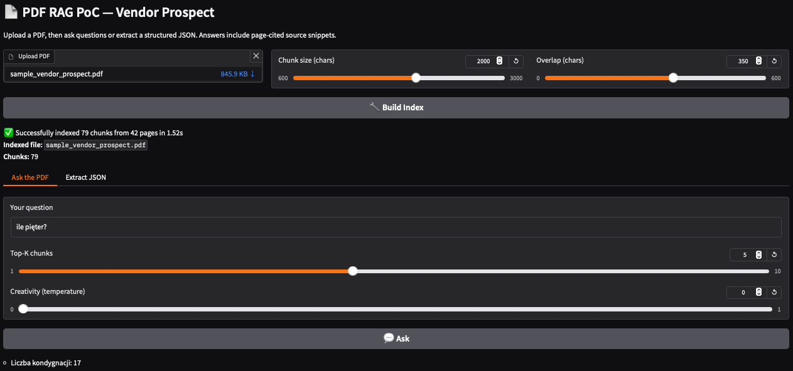
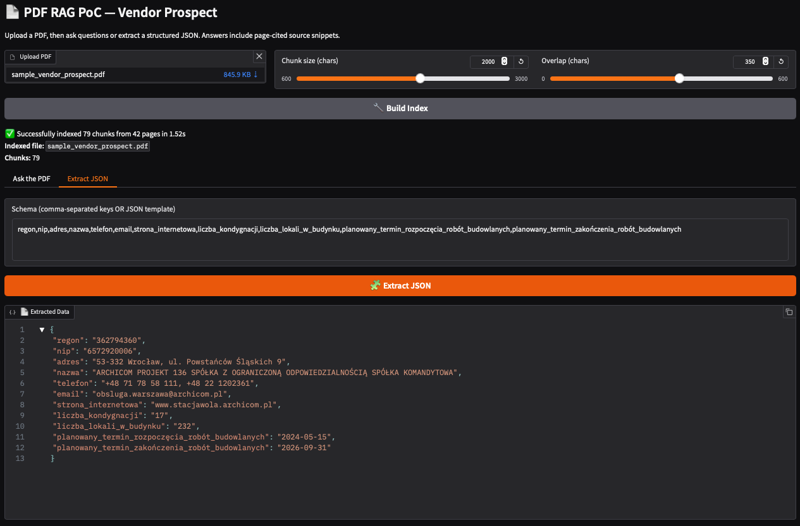

# PDF RAG System 📄🤖

A professional-grade document analysis and structured data extraction system using Retrieval-Augmented Generation (RAG) with OpenAI embeddings and FAISS vector search.

## 🏗️ Architecture

This system follows clean architecture principles with proper separation of concerns:

```
src/
├── core/                   # Core configuration and utilities
│   ├── config.py          # Application configuration
│   └── __init__.py
├── models/                 # Data models and schemas
│   └── __init__.py        # DocumentChunk dataclass
├── services/              # Business logic and processing
│   ├── document_processor.py      # PDF text extraction and chunking
│   ├── embedding_service.py       # OpenAI embedding operations
│   ├── vector_store.py           # FAISS vector storage and search
│   ├── document_indexer.py       # Document processing orchestrator
│   ├── question_answering.py     # Hybrid Q&A system
│   ├── data_extraction.py        # Structured data extraction
│   └── __init__.py
├── ui/                    # User interface components
│   ├── interface.py       # Gradio interface
│   └── __init__.py
└── __init__.py
```

## ✨ Features

- **Professional Architecture**: Clean, modular, maintainable code structure
- **Hybrid Search**: Combines semantic embeddings with keyword pattern matching
- **Multi-language Support**: Optimized for Polish and English documents
- **Structured Data Extraction**: Extract specific fields as JSON from any page
- **Interactive Web UI**: Built with Gradio for easy document analysis
- **Production Ready**: Proper error handling, logging, and configuration management

## 🚀 Quick Start

### Prerequisites
- Python 3.8+
- OpenAI API key

### Installation

1. **Clone the repository:**
   ```bash
   git clone <repository-url>
   cd gradio-pdf-rag-poc
   ```

2. **Create virtual environment:**
   ```bash
   python -m venv .venv
   source .venv/bin/activate  # On Windows: .venv\Scripts\activate
   ```

3. **Install dependencies:**
   ```bash
   pip install -r requirements.txt
   ```

4. **Set environment variables:**
   ```bash
   export OPENAI_API_KEY="your-api-key-here"
   ```

5. **Run the application:**
   ```bash
   python main.py
   ```

6. **Open your browser** to `http://localhost:7860`

## 📋 Usage

### Document Processing
1. **Upload PDF**: Select your PDF document
2. **Configure Settings**: Adjust chunk size and overlap if needed
3. **Build Index**: Click to process and index the document

### Question Answering
Ask questions in natural language (English or Polish) using the **"Ask the PDF"** tab:



*Example: Asking "ile pięter" (how many floors) returns "Liczba kondygnacji: 17" - the system successfully extracts specific information from the document using hybrid semantic and keyword search.*

**Supported question types:**
- "What is the company name?" / "Podaj nazwę firmy"
- "Podaj numer REGON" (Polish business registration number)
- "How many floors does the building have?" / "Ile pięter ma budynek?"
- "What is the address?" / "Podaj adres"

### Data Extraction
Extract structured JSON data using the **"Extract JSON"** tab:



*Example: The system successfully extracts all specified fields from a 42-page Polish document, including REGON (362794360), NIP, company details, and building specifications like "liczba_kondygnacji": "17" and "liczba_lokali_w_budynku": "232".*

**Features:**
- Define schema with comma-separated field names or JSON template
- Extract data from any page of the document
- Supported fields: REGON, NIP, address, company name, phone, email, building specs, etc.
- Handles Polish terminology and multi-page documents

## 🔧 Configuration

Key settings in `src/core/config.py`:

```python
# OpenAI Models
CHAT_MODEL = "gpt-4o-mini"
EMBEDDING_MODEL = "text-embedding-3-small"

# Document Processing
DEFAULT_CHUNK_SIZE = 2000
DEFAULT_OVERLAP = 350

# Search Parameters
DEFAULT_TOP_K = 5
SIMILARITY_THRESHOLD = 0.7
```

## 🏛️ Technical Architecture

### Core Components

- **DocumentProcessor**: Handles PDF text extraction and intelligent chunking
- **EmbeddingService**: Manages OpenAI embeddings with proper normalization
- **VectorStore**: FAISS-based similarity search with cosine distance
- **DocumentIndexer**: Orchestrates the complete indexing pipeline
- **QuestionAnsweringSystem**: Hybrid semantic + keyword search
- **DataExtractionSystem**: Intelligent structured data extraction

### Key Technologies

- **OpenAI GPT-4**: Advanced language understanding and generation
- **FAISS**: High-performance vector similarity search
- **PyMuPDF**: Robust PDF text extraction
- **Gradio**: Modern web interface framework
- **NumPy**: Efficient numerical operations

## 📊 Performance Features

- **Hybrid Search**: Combines semantic understanding with keyword precision
- **Smart Chunking**: Respects sentence boundaries for better context
- **Efficient Indexing**: Optimized embeddings and vector operations
- **Memory Management**: Proper resource cleanup and error handling

## 🌍 Multi-language Support

Optimized patterns for Polish document analysis:
- REGON (9-digit registration numbers)
- NIP (10-digit tax IDs)
- Polish addresses and postal codes
- Company names and legal forms
- Technical terminology (kondygnacje, lokale, etc.)

## 🔒 Security & Best Practices

- Environment-based configuration
- Input validation and sanitization
- Proper error handling and logging
- Resource cleanup and memory management
- Type hints for better code quality

## 📈 Scalability

The modular architecture supports:
- Easy addition of new extraction patterns
- Custom embedding models
- Different vector store backends
- Extended UI components
- API endpoints for programmatic access

## 🤝 Contributing

This codebase follows professional development standards:
- Clean architecture principles
- Comprehensive type hints
- Detailed docstrings
- Modular design patterns
- Separation of concerns

## 📄 License

MIT License - See LICENSE file for details
